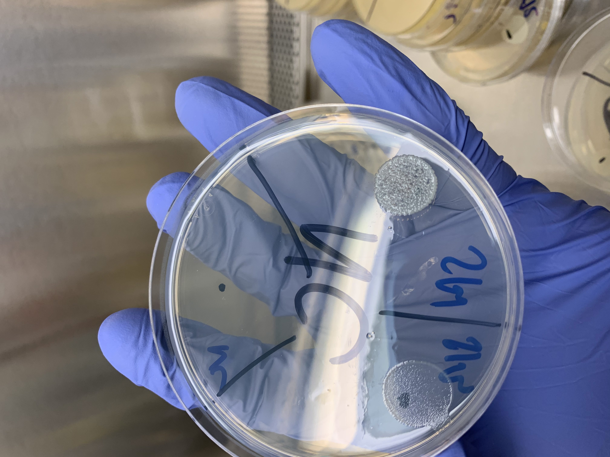

***

The first objective of this study was to investigate the phenotypic in vitro activity of NASM isolated from the teat apex of organic cows with and without an IMI caused by Staphylococcus aureus (SAU) or Streptococcus spp. and Streptococcus-like organisms (SSLO) on the week preceding IMI diagnosis. Our second objective was to investigate the relationship between presence of an IMI caused by SAU or SSLO and NASM counts on teat-apex swab samples collected the week prior to the diagnosis of SAU or SSLO IMI. Lastly, our third objective was to explore the relationship between the assigned taxonomy of NASM species and the presence of inhibitory activity against SAU and SUB. 

 

